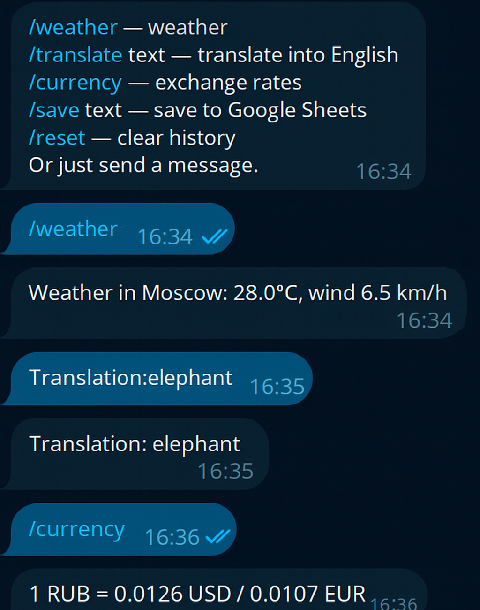

# Telegram Bot



## Описание

Этот проект — персональный Telegram-бот-ассистент на Python, обладающий широким набором функций для помощи пользователю в повседневных задачах.

## Преимущества

- **Интеграция с внешними API:**
  - Получение актуальной погоды через Open-Meteo и геокодинг через Nominatim.
  - Работа с курсами валют через API Apilayer.
  - Перевод текста с помощью Google Cloud Translate.
  - Генерация ответов с использованием OpenAI GPT-4o-mini.
  - Получение случайных изображений с внешних сервисов (TheCatAPI).
- **Интеграция с Google Sheets:**
  - Сохранение пользовательских данных напрямую в Google Таблицы для последующего анализа или хранения.
- **Асинхронная архитектура:**
  - Высокая производительность и отзывчивость благодаря использованию асинхронных библиотек (aiogram, httpx).
- **Гибкая обработка пользовательских сообщений:**
  - Ведение истории диалога, персонализация ответов, поддержка естественного языка.


## Технологии
- Python 3.10+
- [aiogram](https://docs.aiogram.dev/) — Telegram Bot API
- [httpx](https://www.python-httpx.org/) — асинхронные HTTP-запросы
- [gspread](https://gspread.readthedocs.io/) — работа с Google Sheets
- [google-cloud-translate](https://cloud.google.com/translate/docs) — перевод текста
- [openai](https://platform.openai.com/docs/api-reference) — генерация ответов

## Настройка
1. Скопируйте `.env.example` в `.env` и укажите свои токены:
   - `BOT_TOKEN` — токен Telegram-бота
   - `OPENAI_API_KEY` — ключ OpenAI (опционально)
2. Поместите файл сервисного аккаунта Google (`service.json`) в корень проекта (НЕ добавляйте в git).
3. Установите зависимости:
   ```bash
   pip install -r requirements.txt
   ```
4. Запустите бота:
   ```bash
   python bot.py
   ```

## Важно
- Не храните секретные ключи в репозитории!
- Для работы с Google Sheets и Translate требуется файл `service.json` (добавьте в `.gitignore`).

---

**Автор:** Valerya 